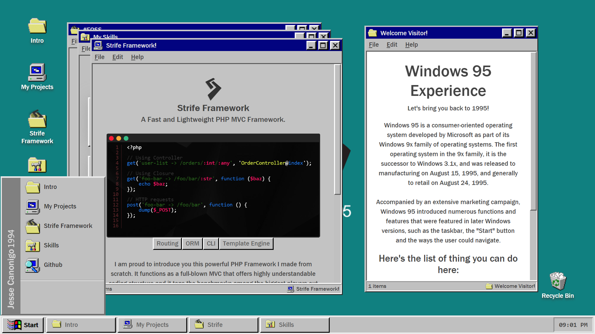

# Windows 95 Experience
### A web-based simulation of the well-known legacy OS Windows 95  
#### List of things you can do:   

> **Drag and drop icons/folders**  
> **Resize folders**  
> **Open icons on the desktop/start menu**  
> **Minimize/Maximize folders**  
> **Interact with buttons**  
> **And of course, read something.**  
> **View it in Fullscreen**  

### <a href="https://strifejeyz.github.io/windows-95/">Windows 95 Experience Demo</a>  
